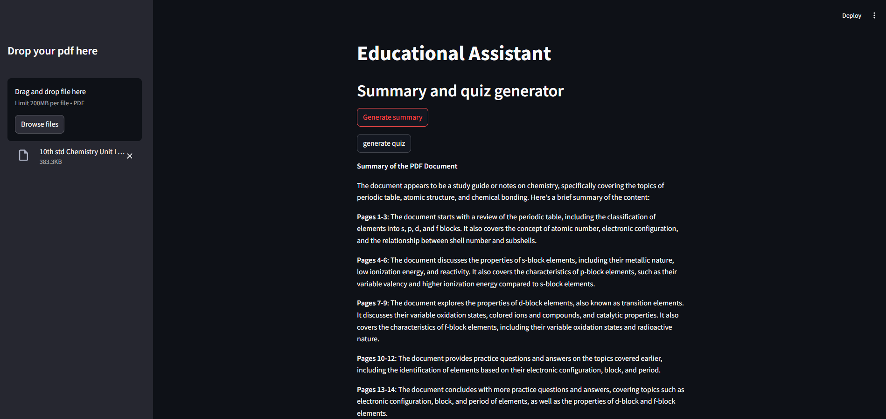
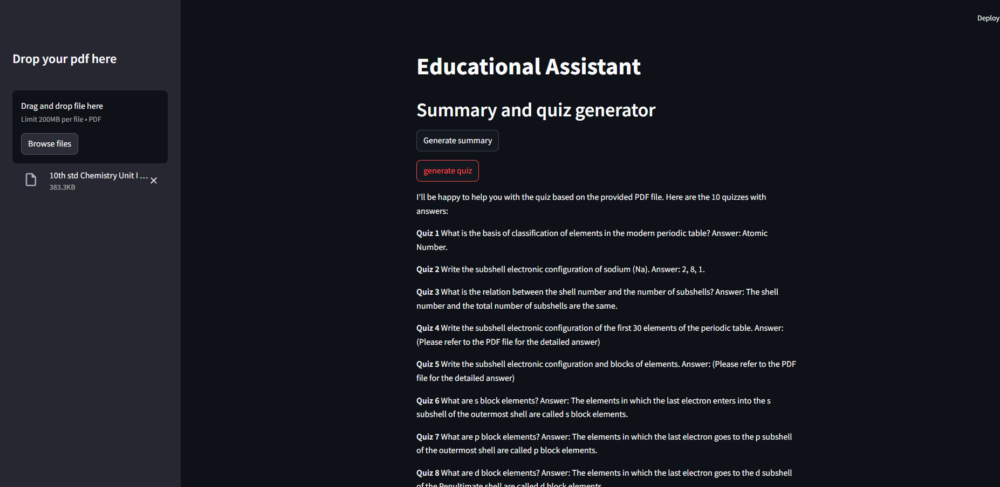

# Unleash Your Knowledge Wizard: Summaries and Quizzes Made Easy! 📚✨

## Overview

This project is a Educational Assistant powered by Large Language Models (LLM) and RAG model. It allows users to generate summary and quizes related to pdf that user been uploaded. The chatbot utilizes a RAG (Retrieval-Augmented Generation) model to enhance its performance.

## Features

- Utilizes LLM for natural language understanding and generation.
- Allows users to Generate Quizes and Summary.
- Provides accurate and concise responses to user.
- User-friendly interface for seamless interaction.

## Usage

1. Clone the repository to your local machine.
2. Install the required dependencies specified in the `requirements.txt` file.
3. Run the app script to start the Assistant.
4. Upload your pdf document and select the option that you want.

## Technologies Used

- Large Language Models (LLM)
- RAG (Retrieval-Augmented Generation)
- Groq API
- Llama3 Model
- Python
